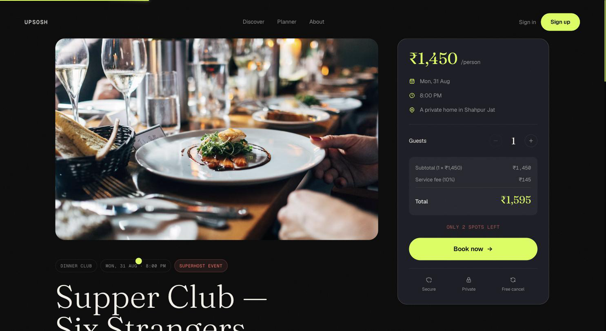
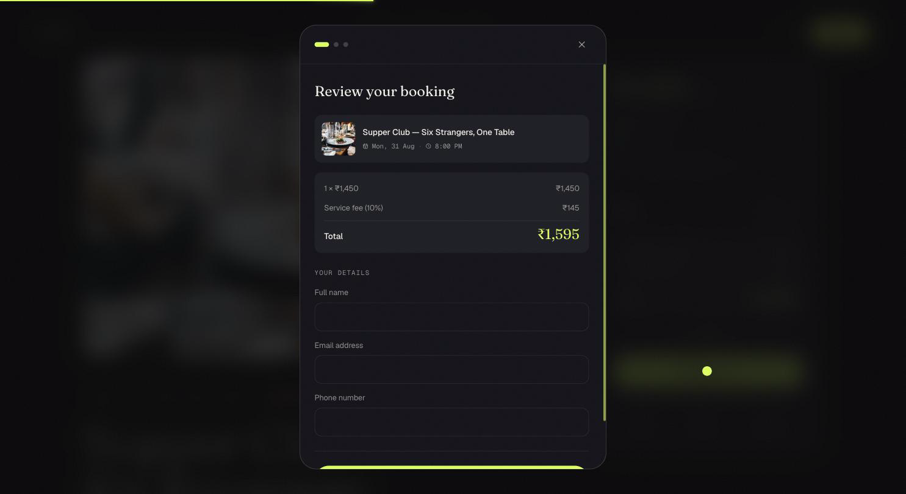

# upSosh

A booking platform for premium micro-events — run clubs, supper clubs, workshops, book circles. Hosts list an event, attendees browse and pay through Razorpay, and a QR ticket lands in their inbox.

**Live:** [upsosh.app](https://upsosh.app)

---

## Screenshots

| `/discover` | Event detail |
|---|---|
|  |  |

| Booking flow | Ticket |
|---|---|
|  | *(`docs/screenshots/ticket.png` — add a confirmed QR ticket here; capturing one needs a real logged-in session with a paid booking, which wasn't captured here)* |

---

## What it does

An attendee browses events on `/discover`, opens one, and books it. Free events confirm instantly; paid events go through a real Razorpay checkout, and the booking only confirms once the server has independently verified the payment. A host applies for verification, and once approved can create and manage their own events from a dashboard that shows real booking counts and revenue, not client-side estimates. Everything — session, payment amount, resource ownership — is decided server-side; the frontend never gets to assert anything the backend trusts on faith.

---

## Stack

| Layer | Technology | Why |
|---|---|---|
| Frontend | Next.js 14 (App Router), React 18, TypeScript | App Router for the file-based routing and server components; TypeScript because a booking/payment app is exactly the kind of thing you don't want to typo your way into a bug in |
| Styling | Tailwind CSS | Fast to build a consistent dark-mode design system without hand-rolling a CSS architecture |
| State | Zustand | Smaller and less ceremony than Redux for what this app needs — a handful of stores (auth, booking flow, discover filters), not a large normalized cache |
| Animation | Framer Motion, GSAP | Framer Motion for React-driven UI motion (modals, page transitions); GSAP specifically for the booking flow's more hand-tuned choreography — both were already in use before this became a two-library situation worth avoiding, so the honest reason the second one is still here is inertia, not a considered choice |
| Backend | Express 4, TypeScript | A REST API with no unusual routing needs; Express is the boring, well-understood choice, and boring is correct for a payment path |
| ORM | Prisma 6 | Generated types keep the database schema and TypeScript types from silently drifting apart, and migrations are checked into git |
| Database | PostgreSQL 16 | Relational integrity matters here — a booking, its event, and its payment status need real foreign keys and transactions, not eventual consistency |
| Auth | Custom JWT (`jsonwebtoken`) + bcrypt, httpOnly cookie | No session store to run; the cookie is httpOnly so an XSS can't read it out of `localStorage` (this app used to keep a copy there — see `lib/stores/auth.ts`'s comments for why that changed) |
| Payments | Razorpay | The processor with the most direct India/UPI support, which is the primary market this app is built for |
| Email | Resend | Small, modern transactional-email API; no queue infrastructure needed at this volume |
| Images | Cloudinary | Upload + transform + CDN in one service, so the backend doesn't need its own image-processing pipeline |
| AI planner | OpenRouter (`google/gemini-2.0-flash-001`) | One API surface for LLM calls without hard-coupling to a single provider's SDK |
| Testing | Jest + Supertest (backend), Playwright (one real E2E) | Supertest drives the actual Express app in integration tests against a real Postgres, not a mocked one; Playwright's single test exercises the full stack including a real Razorpay test-mode payment |
| Hosting | Railway (backend), Vercel (frontend) | Railway for a long-running Node process with a straightforward Nixpacks build; Vercel because it's the reference host for Next.js |

---

## Architecture

```
┌──────────────┐        /api/*         ┌──────────────┐        Prisma        ┌──────────────┐
│   Next.js    │ ───────────────────▶  │   Express    │ ───────────────────▶ │  PostgreSQL  │
│  (Vercel)    │ ◀─────────────────── │  (Railway)    │ ◀─────────────────── │              │
└──────────────┘   httpOnly cookie     └──────┬───────┘                      └──────────────┘
                                               │
                       ┌───────────────────────┼───────────────────────┬──────────────────────┐
                       ▼                       ▼                       ▼                       ▼
                ┌─────────────┐        ┌─────────────┐        ┌─────────────┐        ┌─────────────┐
                │  Razorpay   │        │ Cloudinary  │        │   Resend    │        │ OpenRouter  │
                │  payments   │        │   images    │        │   email     │        │  AI planner │
                └─────────────┘        └─────────────┘        └─────────────┘        └─────────────┘
```

**Auth.** `POST /api/auth/signin` (or `/signup`) checks the password with bcrypt and signs a JWT (`{ userId }`, 7-day expiry) into an httpOnly cookie — `backend/src/routes/auth.ts`. Every request that needs a session sends that cookie automatically (`credentials: 'include'` on the frontend, `cookie-parser` on the backend); there's no bearer token stored in JS anywhere. `middleware/auth.ts`'s `requireAuth` verifies the JWT, re-reads the user from the database (so a soft-deleted user's existing token stops working immediately, not just at next expiry), and attaches `req.user`. Google sign-in (`POST /api/auth/google`) is a second way to reach the same session: it verifies a Google-issued ID token against Google's public keys (`google-auth-library`) instead of checking a password, then signs the identical JWT cookie.

**Payments** are the part of this app where "the frontend asked for it" is never sufficient justification for anything happening. The full walkthrough is below, in its own section — it's the most technically involved part of the codebase and deserves more than a paragraph.

---

## Getting started

### Prerequisites

- **Node 20+** (developed on 22) — `node -v`
- **npm 10+** — ships with Node 20+
- **Docker**, for local Postgres (or a native Postgres 14+ install)

Optional — the app runs without these, but the corresponding feature is disabled: a Razorpay test account (payments), a Resend key (email), Cloudinary credentials (uploads), an OpenRouter key (the AI planner), a Google OAuth Client ID (Google sign-in).

### Steps

Verified by actually deleting `node_modules`, dropping the local database, and running this exact sequence on a clean checkout before writing it down.

```bash
# 1. Clone and install
git clone <your-repo-url> upSosh
cd upSosh
npm install                    # installs both workspaces, runs `prisma generate`

# 2. Start Postgres
docker compose up -d           # Postgres 16 on :5432, user/pass/db all "postgres"/"postgres"/"upsosh"

# 3. Env files, migrate, seed — one command
npm run setup
```

`npm run setup` copies `backend/.env.example` → `backend/.env` and `frontend/.env.example` → `frontend/.env` (never overwriting a file that already exists), applies every pending Prisma migration, and seeds 3 users, 3 hosts, and 10 events dated relative to today (`backend/src/scripts/seed.ts`). It prints this at the end:

```
  LOG IN WITH ANY OF THESE (password is the same for all three):

    admin@upsosh.test     upsosh123
      Admin — can reach /admin/payments and the host-approval endpoints
    host@upsosh.test      upsosh123
      Host — owns the seeded events, can create more
    user@upsosh.test      upsosh123
      Attendee — use this one to test the booking flow
```

```bash
# 4. Run it
npm run dev
```

| | |
|---|---|
| Frontend | http://localhost:3000 |
| API | http://localhost:4000 |
| Health check | http://localhost:4000/health |

**Port 5432 already taken by another project?** Postgres will accept the connection and then reject the password — it shows up as `authentication failed`, not `can't connect`, which is confusing the first time. Pick a different port and pass it to both commands:

```bash
POSTGRES_PORT=5433 docker compose up -d
POSTGRES_PORT=5433 npm run setup
```

### Testing a payment

Sign in as `user@upsosh.test`, open any **paid** event from `/discover` (free ones skip checkout entirely), and book it. In the Razorpay test-mode checkout:

| Field | Value |
|---|---|
| Card number | `5267 3181 8797 5449` (Mastercard) |
| Expiry | any future date, e.g. `12/30` |
| CVV | any 3 digits |
| OTP | any 6 digits — test mode accepts anything |

> Use this card, not the commonly-cited `4111 1111 1111 1111`. Razorpay's BIN lookup flags that number as an internationally-issued test card, and this project's test account has international cards disabled — it fails with *"International cards are not supported."* `5267 3181 8797 5449` is Razorpay's own documented India-domestic test Mastercard, and it's the exact card `frontend/tests/booking-flow.spec.ts` uses for the one real end-to-end payment test in this repo.

Then check `/my-bookings` — the booking should read *confirmed* with a scannable QR ticket.

---

## Environment variables

**`backend/.env` holds every secret. `frontend/.env` holds nothing secret** — Next.js inlines every `NEXT_PUBLIC_*` variable into the browser bundle at build time, so anything there is public by definition. Full annotated versions live in `backend/.env.example` and `frontend/.env.example`.

### Backend

| Variable | Required | Purpose | Where to get it |
|---|---|---|---|
| `DATABASE_URL` | **Yes** | Postgres connection string | Local Docker, or your host's provisioned database |
| `JWT_SECRET` | **Yes** | Signs session cookies | Any random string locally; a real secret before deploying |
| `PORT` | No (default `4000`) | API port | — |
| `FRONTEND_URL` | Yes | Added to the CORS allow-list (`src/index.ts`) | Your frontend's origin |
| `RAZORPAY_KEY_ID` / `RAZORPAY_KEY_SECRET` | For payments | Order creation + signature verification | [dashboard.razorpay.com](https://dashboard.razorpay.com) → Settings → API Keys |
| `RAZORPAY_WEBHOOK_SECRET` | For webhooks | `POST /api/payments/webhook` fails closed (returns 500, verifies nothing) without this — it's not optional the way a missing feature key is | Razorpay dashboard → Settings → Webhooks → your webhook → Secret |
| `GOOGLE_CLIENT_ID` | For Google sign-in | Verifies the ID token's audience | [console.cloud.google.com](https://console.cloud.google.com) → APIs & Services → Credentials → OAuth client ID (Web application) |
| `OPENROUTER_API_KEY` | For `/planner` | AI event planner | [openrouter.ai](https://openrouter.ai) |
| `RESEND_API_KEY` | For email | Booking confirmations, password resets | [resend.com](https://resend.com) |
| `CLOUDINARY_CLOUD_NAME` / `CLOUDINARY_API_KEY` / `CLOUDINARY_API_SECRET` | For uploads | Host verification documents, event images | [cloudinary.com](https://cloudinary.com) |

### Frontend

| Variable | Required | Purpose | Notes |
|---|---|---|---|
| `NEXT_PUBLIC_RAZORPAY_KEY_ID` | **Yes** | Opens the Razorpay checkout widget | **Flagging this explicitly: its absence used to make paid bookings silently skip payment and confirm for free.** That's fixed now — `lib/stores/booking.ts` throws *"Payments are not configured"* instead — but the failure mode changing from silent-and-dangerous to loud-and-safe doesn't make the variable optional. Leave it unset and nobody can complete a paid booking at all. |
| `NEXT_PUBLIC_BACKEND_URL` | Yes | Origin the `next.config.js` rewrite proxies `/api/*` to | `http://localhost:4000` locally |
| `NEXT_PUBLIC_API_URL` | No | Absolute API base for the handful of call sites that don't go through the rewrite proxy | Leave empty locally |
| `NEXT_PUBLIC_FRONTEND_URL` | Yes | This app's own public origin | Used for absolute links and Playwright's `baseURL` |
| `NEXT_PUBLIC_GOOGLE_CLIENT_ID` | No | Renders Google's "Continue with Google" button | Must match backend's `GOOGLE_CLIENT_ID` exactly. Unset → the button just doesn't render, no broken UI |
| `NEXT_PUBLIC_APPLE_CLIENT_ID` | No | — | Not implemented; unused by any component |

---

## Project structure

```
upSosh/
├── backend/
│   ├── prisma/
│   │   ├── schema.prisma        User · Notification · Host · Event · Booking · HostApplication · Upload
│   │   └── migrations/          one directory per migration, applied in order by `prisma migrate deploy`
│   ├── src/
│   │   ├── routes/              auth · users · events · hosts · bookings · payments · notifications · ai · uploads
│   │   ├── middleware/          auth.ts (requireAuth/requireRole/requireHostStatus) · validate.ts (zod)
│   │   ├── lib/                 prisma client · email (Resend) · notify (in-app notifications) · schemas (zod)
│   │   ├── scripts/seed.ts      the `npm run db:seed` seed data
│   │   └── index.ts             app wiring — helmet, CORS allow-list, rate limiters, route mounts
│   └── tests/                   4 Jest/Supertest integration suites, run against a real Postgres
├── frontend/
│   ├── app/                     Next.js App Router — one directory per route
│   ├── components/              shared UI (BookingFlow, GlobalHeader, GoogleSignInButton, ...)
│   ├── lib/
│   │   ├── stores/               Zustand: auth, booking, discover filters
│   │   ├── api.ts                typed fetch wrapper for the `/api/*` routes
│   │   └── motion.ts             the animation system's single source of truth
│   └── tests/booking-flow.spec.ts   the one Playwright E2E test — a real signup-to-ticket run
├── scripts/setup.mjs            `npm run setup` — env files, migrate, seed, in one command
├── railway.toml                 backend deploy config (Nixpacks build + migrate-then-start)
├── docker-compose.yml           local Postgres
├── FIXPLAN.md                   phase-by-phase log of what was found and fixed, anchored to file:line
└── SECURITY.md                  two real vulnerabilities found and fixed in the payment path
```

---

## Payment flow

The part of this codebase where getting the details wrong means someone pays the wrong amount, or pays once and gets confirmed twice, or doesn't pay at all and gets confirmed anyway. Full code in `backend/src/routes/payments.ts` and `backend/src/routes/bookings.ts`.

1. **Booking creation — `POST /api/bookings`.** The client sends `eventId` and guest details, nothing about price. The server looks up the event, computes `ticketPrice + platformFee = totalAmount` itself, and creates a `Booking` row with `paymentStatus: 'unpaid'`. **The amount the client will eventually be charged is decided here, from `booking.totalAmount`, and nowhere in the flow does the client get another chance to influence it** — this is the exact thing that used to be a vulnerability (see `SECURITY.md` §1). A free event confirms and reserves its seat in this same step, because there's no later "payment succeeded" moment to reserve it at.

2. **Order creation — `POST /api/payments/create-order`.** For a paid event, the frontend calls this with only a `bookingId`. The handler re-fetches the booking, confirms the requesting user owns it, and computes `amountInPaise = Math.round(booking.totalAmount * 100)` — read from the database row, never from the request body. It creates a Razorpay order for that exact amount and immediately writes `order.id` onto `booking.razorpayOrderId`, binding this specific order to this specific booking before any payment has happened.

3. **Checkout.** The frontend opens Razorpay's hosted checkout with the returned `orderId`, `amount`, and `key`. The user pays. Razorpay's SDK calls back into the frontend with `razorpay_order_id`, `razorpay_payment_id`, and `razorpay_signature`.

4. **Verification — `POST /api/payments/verify`.** Three checks, in order, each one closing a real hole found in this exact code:
   - **Signature.** `HMAC-SHA256(order_id + '|' + payment_id, RAZORPAY_KEY_SECRET)` must match `razorpay_signature`, compared with `crypto.timingSafeEqual` rather than `===` (a `!==` on a hex string short-circuits at the first differing byte, which is a timing oracle).
   - **Binding.** `razorpay_order_id` must equal the `booking.razorpayOrderId` written in step 2. A valid signature only proves *some* real payment happened on the account — it says nothing about which booking it was for, without this check (see `SECURITY.md` §2).
   - **State.** `paymentStatus` must currently be `'unpaid'`, enforced by a conditional `updateMany` (`WHERE paymentStatus = 'unpaid'`) rather than a plain `update` — the WHERE clause is what makes two concurrent verification requests for the same booking resolve to exactly one write, not a race.

   Only after all three pass does the booking flip to `paymentStatus: 'paid'`, `status: 'confirmed'`, the event's `attendees` count increments, and a confirmation email + in-app notification fire.

5. **Webhook — `POST /api/payments/webhook`.** Razorpay also calls this server-to-server for `payment.captured`, `payment.failed`, and `refund.processed`, independent of whether the client's browser ever got back to `/verify`. It's mounted with `express.raw()` ahead of the global JSON parser specifically so the handler can verify Razorpay's signature against the *exact bytes received* — re-serializing a parsed object with `JSON.stringify` doesn't reliably reproduce the original bytes (whitespace, unicode escaping), which silently broke this check even with the correct secret. An unset `RAZORPAY_WEBHOOK_SECRET` fails every delivery closed (500, nothing verified) rather than the old behavior of skipping verification when the secret was missing.

6. **Recovery from a dropped connection.** If the network drops after Razorpay captures the payment but before the client's `/verify` call completes, the booking is stuck `unpaid` even though real money moved. The `payment.captured` webhook handler is exactly this recovery path: it runs the same `WHERE paymentStatus = 'unpaid'` conditional update against `razorpayOrderId`, so whichever of `/verify` or the webhook arrives first does the real work, and the second one is a guaranteed no-op against the same WHERE clause — never a double-write, and never a booking left stuck paid-for-but-unconfirmed.

---

## Security

- **Passwords** are hashed with bcrypt at cost factor 12 (`backend/src/routes/auth.ts`). A Google-only account has no password at all (`User.password` is nullable) rather than a fake one.
- **Sessions** are a JWT in an httpOnly cookie, never in `localStorage` or a JS-readable cookie — `lib/stores/auth.ts` on the frontend explicitly purges any credential material a previous version of this app left in `localStorage`, on every load.
- **Password reset tokens** are generated with `crypto.randomBytes(32)`, sent to the user, and stored server-side as a SHA-256 hash with an expiry — a leaked database row alone isn't a usable reset token.
- **Ownership checks.** Every `:id` endpoint that reads or mutates a specific resource re-checks that the authenticated user actually owns it — `booking.userId !== req.user!.id` before returning a booking, before creating a payment order against it, etc. Guarded by `backend/tests/authorization.test.ts`, which reproduces the exact IDOR shape (user A fetching/mutating user B's resource) for bookings, payment orders, event creation, and the admin host-approval endpoint.
- **Route protection** is middleware, not a per-handler check scattered through the code — `requireAuth`, `requireRole`, `requireHostStatus` in `backend/src/middleware/auth.ts`.
- **Rate limiting** is two-tiered (`backend/src/index.ts`): 100 requests / 15 minutes generally, 10 / 15 minutes on `/api/auth/*` specifically, so a credential-stuffing attempt against signin gets throttled far harder than normal browsing traffic.
- **CORS** is an explicit allow-list (`www.upsosh.app`, `upsosh.app`, `localhost:3000`, plus `FRONTEND_URL`), not a wildcard.

Two real vulnerabilities were found and fixed in the payment path specifically — a client-controlled payment amount, and a cross-booking signature replay. Both are narrated in full, with the actual exploit and the regression test that now guards each one, in **[SECURITY.md](./SECURITY.md)**.

---

## Testing

```bash
# Backend — 16 Jest/Supertest integration tests, against a real Postgres
cd backend && npm test

# Frontend — one real Playwright E2E test (see "Testing a payment" above for the card)
cd frontend && npm run test:e2e
```

**Backend, what's covered** (`backend/tests/`): password hashing on signup and the generic-error-on-wrong-password behavior (`auth.test.ts`); IDOR checks across bookings, payment orders, event creation, and host approval (`authorization.test.ts`); booking capacity including a genuine concurrency test — N+1 simultaneous requests for the last seat, asserting exactly one succeeds — and refund-on-cancel (`booking.test.ts`); the client-controlled-amount and signature-replay regression tests described in `SECURITY.md` (`payments.test.ts`). All 16 run against a real database via Supertest driving the actual Express app — nothing here is mocked at the HTTP layer.

**Frontend, what's covered:** one test, `frontend/tests/booking-flow.spec.ts` — signup, browse to a paid event, book it, pay with a real Razorpay test-mode card including the 3-D Secure OTP step, land on the in-modal confirmation, and see the confirmed ticket in `/my-bookings`. It's slow (a real network round-trip through Razorpay's actual checkout) and needs real `RAZORPAY_TEST_KEY_ID`/`RAZORPAY_TEST_KEY_SECRET` credentials to run at all — without them it fails at the checkout step, which is expected, not a bug in the test.

**What's honestly not covered:** no frontend component/unit tests exist (`frontend/package.json`'s `test` script is `jest --passWithNoTests` — it passes because there's nothing to run, not because anything was verified). No test covers the AI planner, image uploads, or the admin host-approval UI beyond the one authorization check named above. No load/performance testing exists anywhere.

---

## Scope

What's deliberately not built, and why — so a missing feature reads as a decision, not an oversight.

**Host payouts.** Money flows in (Razorpay → the platform's account); nothing sends money back out to hosts. A real payout system needs KYC on every host (bank/UPI ownership verification — the RBI won't let a platform disburse to an unverified account), a settlement ledger (`platformFee` needs to be tracked separately from a host's net so payouts and platform revenue aren't reverse-engineered from raw `Booking` rows later), and its own failure/retry handling distinct from checkout. None of that exists; hosts are paid manually, outside the app.

**Real-time features.** No WebSockets or SSE anywhere in the codebase. Attendee counts and the host/admin dashboards are poll/refetch-on-navigation, not push. A host watching their event's capacity fill up won't see it update live without refreshing.

**Reviews and ratings.** No `Review` or `Rating` model in `schema.prisma`. Host ratings shown in the UI are seed/display data, not a real review system attendees can write to.

**Single currency.** `currency: 'INR'` is hardcoded in `payments.ts`, and every price display uses `toLocaleString('en-IN')`. No multi-currency support.

**Chargebacks and payment disputes.** Refunds exist (`PATCH /api/bookings/:id/cancel` triggers a real Razorpay refund on cancellation), but there's no flow for a payment dispute Razorpay itself flags, or for an attendee wanting a refund without cancelling. Cancellation is the only refund path.

**Phone verification.** No SMS/OTP step anywhere. `guestPhone` is collected and required on every booking (`backend/src/lib/schemas.ts`) but never verified.

**Full OAuth (Apple, GitHub, etc.).** Google sign-in exists (`POST /api/auth/google`, ID-token flow — see the environment variables table). Nothing else does. `NEXT_PUBLIC_APPLE_CLIENT_ID` is a placeholder variable with no component behind it yet.

---

## Deployment

**Backend → Railway.** `railway.toml` is the single source of truth for the build and start commands — Nixpacks, `npm ci` then `npm run build` inside `backend/`, and a start command that runs `prisma migrate deploy` *before* `npm run start` on every single deploy, so the schema can never drift silently from what's in the repo. Health check is `GET /health`. Set every "backend" variable from the table above in Railway's environment settings — `DATABASE_URL` is normally provisioned automatically if Postgres is a Railway-managed add-on.

**Frontend → Vercel.** Root directory `frontend`, build `npm run build`, output `.next`. Set `NEXT_PUBLIC_API_URL`, `NEXT_PUBLIC_BACKEND_URL`, `NEXT_PUBLIC_FRONTEND_URL`, `NEXT_PUBLIC_RAZORPAY_KEY_ID`, and (optionally) `NEXT_PUBLIC_GOOGLE_CLIENT_ID` in the project's environment variables — these are inlined at build time, so changing one means a new deploy, not a restart.

---

## Known limitations

- `AUDIT.md`, referenced by `FIXPLAN.md` as the analysis the fix plan was built from, isn't present in this repository. `FIXPLAN.md` itself is the more useful document day-to-day — every task in it is anchored to a specific file and line, and each closed one has a written record of what actually changed.
- No structured logging — the backend logs to stdout with bare `console.*` calls, no request IDs, no log levels.
- No CI-enforced database migration check — a migration can be written and merged without CI ever applying it against a real Postgres instance to confirm it runs cleanly.
- The AI planner depends on a single hardcoded OpenRouter model id (`backend/src/routes/ai.ts`); if that model is deprecated or renamed upstream, the planner fails until the id is updated in code.
- Development history (`FIXPLAN.md`) is extensive and worth reading before assuming a gap is unintentional — many things that look like bugs on first read turn out to already be tracked, with the reasoning for the current state written down.
